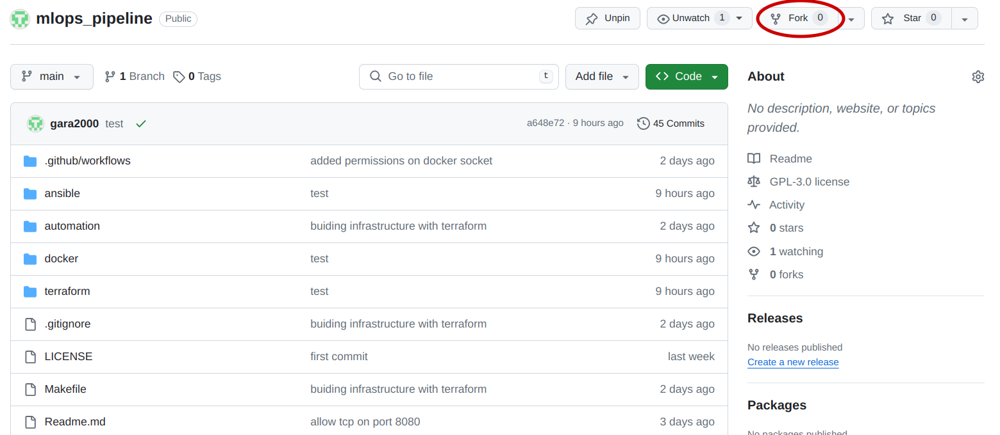
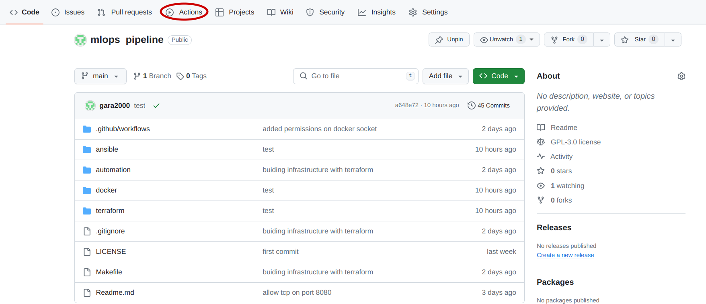
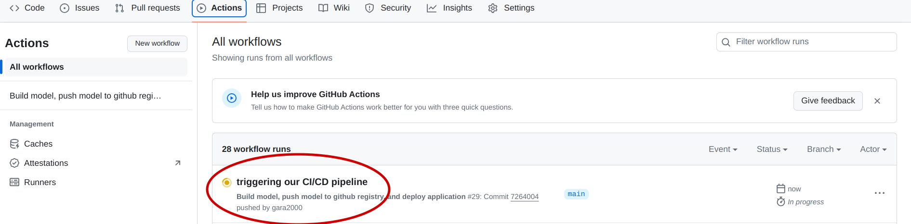

# MLOps Pipeline
This is a **fully automated** MLOps workflow, it includes Cloud infrastructure configuration with **automation scripts** and with **Terraform**, remote server provisioning with **Ansible**, model packaging and deployment with **Docker**. It also includes a **CI/CD pipeline**, for automatically packaging the model into Docker container, push it to a registry and automatically deploy it on an **AWS EC2** Webserver.  

<br/>

**TABLE OF CONTENTS**
<!-- TOC depthFrom:2 -->

- [1- Project requirements](#1--project-requirements)

- [2- Getting started](#2--getting-started)

- [3- Repository content in depth](#3--repository-content-in-depth)
    - [3.1- Infrastructure as Code](#31--infrastructure-as-code)
    - [3.2- Ansible Playbooks](#32--ansible-playbooks)
    - [3.3- Contanerization with Docker](#33--containerization-with-docker)
    - [3.4- CI/CD pipeline](#34--cicd-pipeline)

- [4- Additional resources](#4--additional-resources)

<!-- /TOC -->


<br/>

## 1- Project requirements

### Required packages
1. **Operating System**: all the commands and scripts run in this project are in Linux OS
2. **Terraform**: refer to the [Terraform installation guide](https://developer.hashicorp.com/terraform/install?product_intent=terraform)
3. **Ansible**:  refer to the [Ansible installation guide](https://docs.ansible.com/ansible/latest/installation_guide/intro_installation.html).  
Also make sure you have **openssh-server** installed on your computer, for ansible to be able to SSH into the EC2 instance.
```bash
sudo apt install -y openssh-server
```

### Authentication requirements
#### Authentication to AWS account
In order to be able to create and manage AWS resources you have to authenticate to your AWS account  

1. **AWS CLI installation**: refer to the [AWS CLI installation guide](https://docs.aws.amazon.com/cli/v1/userguide/cli-chap-install.html)

2. **AWS authentication**: refer to the [AWS Authentication with short-term credentials guide](https://docs.aws.amazon.com/cli/v1/userguide/cli-chap-authentication.html) (this is the recommended authentication method)

**Note:** For conformity with this GitHub repository please choose "admin" as profile-name

3. **Verify authentication**: Once the authentication is complete you can verify with the following command
```bash
aws s3 ls --profile admin
```
**Note:** all of the actions performed in this repository are **Free-Tier elligible**

#### Authentication to GitHub CLI
1. GitHub CLI installation: refer to the [GitHub installation guide](https://github.com/cli/cli#installation)

2. GitHub authentication: refer to this [GitHub authentication guide](https://cli.github.com/manual/gh_auth_login)

## 2- Getting started
In this repository, the whole workflow is fully automated, the creation of the infrastructure the provisioning of the remote server and the building and the deployment of the application running the model, can all few command runs.  
**Note**: to go in depth on how every thing is set up please check the next section [Repository content in depth](#3--repository-content-in-depth)

### Fork repository
To be able to enjoy the full potential of this repository, and be able to run the GitHub Actions workflows (CI/CD pipeline), you need to fork the repository, this can be done in two mouse-clicks



### Authentication
To be able to run the IaC scripts, you need to authenticate to AWS, and to be able to deploy the model using the CD you need authentication for the GitHub CLI. Please refer to the [Authentication section](#authentication-requirements).

Once you're authentication is done, you should be good to start!

### Set up the infrastructure with Terraform
The first thing to start with is to create our infrastructure, in particular this will run an AWS EC2 Instance (can be regarded as a Virtual Machine), with network and security configuration. (Refer to [Content section](#3--repository-content-in-depth) for more in depth infromation)

To run the IaC with Terraform run the command:
```bash
make terraform-apply
```

### Provision the newly created instance with Ansible
In this step we will perform the necessary configurations to our EC2 Instance, in particular, we will run an update, we will install Docker and we will configure the GitHub Actions runner needed for the CD pipeline.  
Run the following command so that Ansible can do all of this for us:
```bash
make ansible-all
```
you'll be prompted to enter your sudo password, since Ansible needs elevated privileges to run commands like update and install. Once this is done ansible will fully configure the server for you.

### Continuous Integration / Continuous Deployment
Now that every thing is set, we can run our CI/CD pipline. What makes a CI/CD so powerfull is that it can run automatically when we push changes to the repository (e.g. the application code has changed, new data has been introduced ...). To trigger a change let's run this simple echo command that will add text to a file:
```bash
echo "Time to Deploy" > trigger
```
Then all we need to do is push this change of state to our repository:
```bash
git add trigger
git commit -m "triggering our CI/CD pipeline"
git push -u origin main
```
In your GitHub repository go to "Actions"

You should see the workflow running

Don't hesitate to click on it and inspect the details!


## 3- Repository content in depth

### 3.1- Infrastructure as Code
In this repository we offer two ways of running IaC, the first is using shell scripts, I would call this the rough way. The second is using Terraform, this is the easy yet better way of doing things.
#### IaC with shell scripts
Find the scripts under the `automation/` directory.  
- `automation/build_infra.sh` : builds the infrastructure on AWS
```bash
make auto-build
```
- `automation/connect_to_instance.sh` : connects to the AWS EC2 instance previously created
```bash
make auto-connect
```
- `automation/set_node_address.sh` : adds the IP address of the EC2 instance to the list of hosts provisioned by ansible.
- `automation/clean_infra.sh` : destroys the infrastructure previously created on AWS
```bash
make auto-clean
```
#### IaC with Terraform
With Terraform things are way more easy and better organized, also we do not need to create any cleaning scripts as Terraform does that on our behalf by always keeping track of the state of our infrastructure.  
We create a Terraform module called `ec2_instance`, that does all the network, security configuration and runs the EC2 instance.
Run command `make terraform-apply` to create the infrastructure, and `make terraform-destroy` to destroy it.

### 3.2- Ansible Playbooks
Ansible is a very powerfull tool, that automates provisioning, configuration management, orchestration and many other IT processes.  
In this project we have two playbooks
- Instance configuration (see `ansible/playbooks/bootstrap.yml` and `ansible/playbooks/roles/docker`): runs an update on our instance, installs docker, and adds the `ubuntu` user to the `docker` group to be able to run Docker commands.
- GitHub Actions runner configuration (see `ansible/playbooks/runner.yml` and `ansible/playbooks/roles/runner`): configures the self-hosted GitHub runner that runs the CD workflow.

### 3.3- Containerization with Docker
We use Docker to containerize our Flask application, in order to easily deploy it on the AWS EC2 instance.  
For this we use a simple Dockerfile located under the `docker` subdirectory  
- Build the image locally:
```bash
make docker-build
```
- Run the container locally:
```bash
make docker-run
```
- Stop the container: 
```bash
make docker-stop
```
- Clean up:
```bash
make docker-clean
```

### 3.4- CI/CD pipeline
We use GitHub Actions to automate the process of continuously building the application container and continuously deployingn it on our Cloud Infrastructure.  
The pipeline is defined in the file `.github/workflows/main.yml`, it contains 2 separate jobs:
- the **build** job: builds the docker image containing our Flask application, it then pushes it to the GitHub Registry
- the **deploy** job: pulls the Docker image from the GitHub Registry, and runs the container on our AWS EC2 instance

## 4- Additional Resources
[Nohup Command](https://www.digitalocean.com/community/tutorials/nohup-command-in-linux)  
[GitHub CLI Manual](https://cli.github.com/manual/)  
[AWS CLI Documentation](https://awscli.amazonaws.com/v2/documentation/api/latest/index.html)  
[REST API endpoints for self-hosted runners](https://docs.github.com/en/rest/actions/self-hosted-runners?apiVersion=2022-11-28#get-a-self-hosted-runner-for-a-repository)  
[Ansible Community Documentation](https://docs.ansible.com/)  
[Terraform Community](https://www.terraform.io/)  