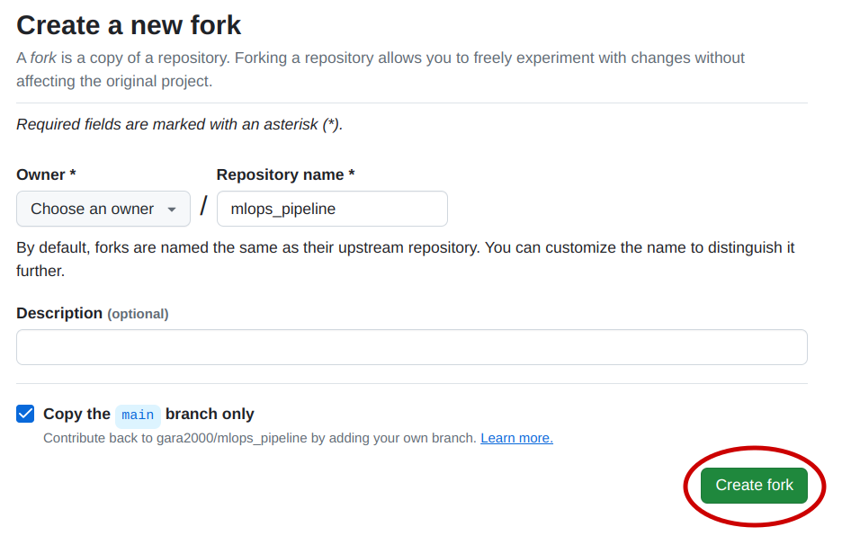

# MLOps Pipeline
This is a fully automated MLOps workflow, it includes Cloud infrastructure configuration with automation scripts and with Terraform, remote server provisioning with Ansible, model packaging and deployment with Docker. It also includes a CI/CD pipeline, for automatically packaging the model into Docker container, push it to a registry and automatically deploy it on an AWS EC2 Webserver.  
In this documentation I explain the step by step workflow, in separate sections.

<br/>

**TABLE OF CONTENTS**
<!-- TOC depthFrom:2 -->

- [1- Authentication requirements](#1--authentication-requirements)

- [2- Getting started](#2--getting-started)

- [3- Repository content in depth](#3--repository-content-in-depth)


- [2- Contenu du site](#2--contenu-du-site)
- [3- Errata : au secours quelque chose ne fonctionne pas !](#3--errata--au-secours-quelque-chose-ne-fonctionne-pas-)
- [4- Contenu chapitre par chapitre](#4--contenu-chapitre-par-chapitre)
- [5- Articles complémentaires](#5--articles-complémentaires)

<!-- /TOC -->


<br/>

## 1- Authentication requirements

### Authentication to AWS account
In order to be able to create and manage AWS resources you have to authenticate to your AWS account  

1. **AWS CLI installation**: refer to the [AWS CLI installation guide](https://docs.aws.amazon.com/cli/v1/userguide/cli-chap-install.html)

2. **AWS authentication**: refer to the [AWS Authentication with short-term credentials guide](https://docs.aws.amazon.com/cli/v1/userguide/cli-chap-authentication.html) (this is the recommended authentication method)

**Note:** For conformity with this GitHub repository please choose "admin" as profile-name

3. **Verify authentication**: Once the authentication is complete you can verify with the following command
```bash
aws s3 ls --profile admin
```
**Note:** all of the actions performed in this repository are **Free-Tier elligible**

### Authentication to GitHub CLI
1. GitHub CLI installation: refer to the [GitHub installation guide](https://github.com/cli/cli#installation)

2. GitHub authentication: refer to this [GitHub authentication guide](https://cli.github.com/manual/gh_auth_login)

## 2- Getting started
In this repository, the whole workflow is fully automated, the creation of the infrastructure the provisioning of the remote server and the building and the deployment of the application running the model, can all few command runs.  
**Note**: to go in depth on how every thing is set up please check the next section [Repository content in depth](#3--repository-content-in-depth)

### Fork repository
To be able to enjoy the full potential of this repository, and be able to run the GitHub Actions workflows (CI/CD pipeline), you need to fork the repository, this can be done in two mouse-clicks



### Authentication
To be able to run the IaC scripts, you need to authenticate to AWS, and to be able to deploy the model using the CD you need authentication for the GitHub CLI. Please refer to the [Authentication section](#1--authentication-requirements).

Once you're authentication is done, you should be good to start!

### Set up the infrastructure with Terraform
The first thing to start with is to create our infrastructure, in particular this will run an AWS EC2 Instance (can be regarded as a Virtual Machine), with network and security configuration. (Refer to [Content section](#3--repository-content-in-depth) for more in depth infromation)

To run the IaC with Terraform run the command:
```bash
make terraform-apply
```

### Provision the newly created instance with Ansible
In this step we will perform the necessary configurations to our EC2 Instance, in particular, we will run an update, we will install Docker and we will Configure the GitHub Actions runner needed for the CD pipeline.  
Run the following command so that Ansible can do all of this for us:
```bash
make ansible-all
```
you'll be prompted to enter your sudo password, since it needs elevated privileges to run commands like update and install. Once this is done ansible will fully configure the server for you.

### Continuous Integration / Continuous Deployment
Now that every thing is set, we can run our CI/CD pipline. What makes a CI/CD so powerfull is that it can run automatically when we push changes to the repository (e.g. the application code has changed, new data has been introduced ...). To trigger a change let's run this simple echo command that will add text to a file:
```bash
echo "Time to Deploy" > trigger
```
Then all we need to do is push this change of state to our repository:
```bash
git add trigger
git commit -m "triggering our CI/CD pipeline"
git push -u origin main
```
Now in your GitHub repository go to "Actions"

You should see the workflow running


## 3- Repository content in depth


This repo can be run in different ways:
1. **Locally in a Python virtual environment:** you can run the application containing the model locally with python, for this we create a Python virtual environment.  
2. **Locally with Docker:** you can create the docker image of the flask-application running the model locally and test the model with the script "predict.sh" [TO BE IMPLEMENTED]  
3. **Cloud Solutions:**  
    1. **AWS EC2 Instance:** this will deploy the app on an EC2 instance that will be publicly available, the process is fully automated and we take 2 approaches to do the automation (IaC):  
        1. **Using automation scripts:** this uses shell scripts, that runs the AWS commands to set the Cloud architecture  
        2. **Using Terraform:** Terraform is a powerful toul that simplifies IaC, and makes it very organized [TO BE IMPLEMENTED] 

** Provisioning with ansible **
-> needs ansible, and openssh-server installation

## Authentication

**Side Note**
generate a token for the runner:
```bash
gh api   --method POST   -H "Accept: application/vnd.githu+json"   -H "X-GitHub-Api-Version: 2022-11-28"   /repos/gara2000/mlops_pipeline/actions/runners/registration-token
```

**Resources**
[Nohup Command](https://www.digitalocean.com/community/tutorials/nohup-command-in-linux)
[GitHub CLI Manual](https://cli.github.com/manual/)
[AWS CLI Documentation](https://awscli.amazonaws.com/v2/documentation/api/latest/index.html)
[REST API endpoints for self-hosted runners](https://docs.github.com/en/rest/actions/self-hosted-runners?apiVersion=2022-11-28#get-a-self-hosted-runner-for-a-repository)
[Ansible Community Documentation](https://docs.ansible.com/)
[Terraform Community](https://www.terraform.io/)